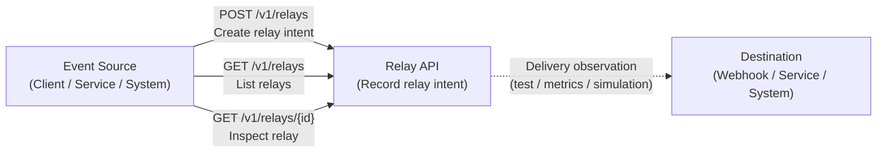

# Diagram 01 — Use-cases (Relay API)

## Purpose of this diagram

* Explain **who** uses the Relay API
* Clarify **what a "relay"** is in abstract terms
* Show **why endpoints are source–target agnostic**
* Establish the mental model used by all later diagrams

This is **not** about implementation, infra, or delivery.

### How to read this diagram

* **Source**  
Any client or system capable of submitting events:
    * backend services
    * batch jobs
    * scripts
    * external systems
* **Relay API**  
Accepts, validates, rate-limits, and stores relay requests.  
It does **not** execute delivery in the baseline.
* **Target**  
The intended destination of the relay:
    * webhook endpoint
    * downstream service
    * external system  
Targets are **described**, not contacted.
* **Dashed arrow**  
Indicates a conceptual future step, not implemented behavior.
