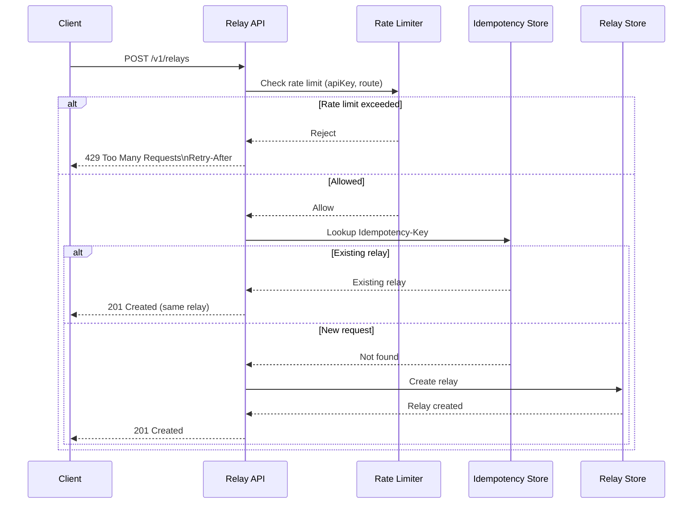

# Diagram 02 — Request flow

Rate limiting & idempotency (`POST /v1/relays`)

## Purpose of this diagram

* Show **exact request flow** for creating a relay
* Make **rate limiting** and **idempotency** explicit
* Clarify **what happens on retries**
* Explain **why ordering of concerns matters**

This diagram focuses on **ingress behavior only**.

### How to read this diagram

1. Rate limiting comes first
    * Applied before idempotency
    * Protects the system from overload
    * Ensures fairness per API key
    * Failed requests still consume rate-limit budget
1. Idempotency is checked only after allowance
    * Prevents duplicate relays on retries
    * Same idempotency key returns the same relay
    * Conflicting payloads result in an error (not shown here)
1. Storage is the final step
    * Relay is created only once
    * Listing and inspection rely on this stored state
