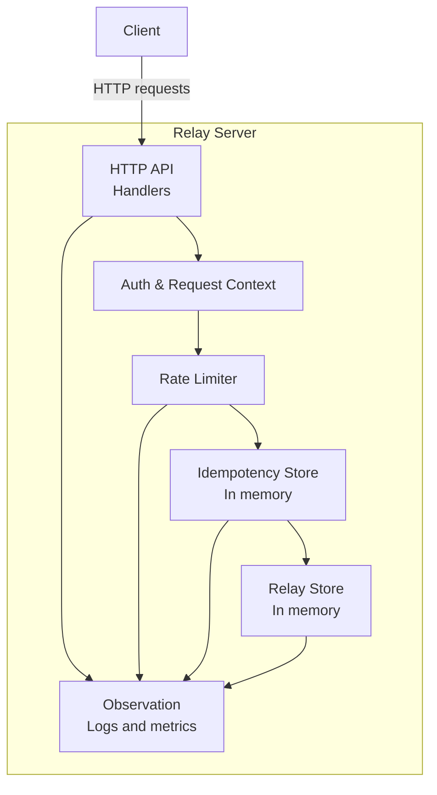

# Diagram 03 — Server components

## Purpose of this diagram

* Show what the server is responsible for
* Make separation of concerns explicit
* Explain where rate limiting and idempotency live
* Prepare ground for testing and observability
* Stay implementation-agnostic (Go / .NET)

This diagram is about structure, not flow.

### How to read this diagram

#### HTTP API

* Owns endpoint semantics
* Maps requests and responses
* Does not contain business state

#### Auth & Request Context

* Extracts API key
* Manages request ID / correlation
* Establishes request scope

#### Rate Limiter

* Enforces fairness and protection
* Applied before idempotency and storage
* Emits rate-limit signals for observation

#### Idempotency Store (baseline)

* In-memory, process-local
* Prevents duplicate relay creation
* TTL-bounded
* Explicitly **not persistent** in baseline

#### Relay Store (baseline)

* Stores relay intents
* In-memory, thread-safe
* Source of truth for GET endpoints

#### Observation

* Logs, metrics, counters
* Observes intent, not delivery
* Must degrade gracefully (no backend required)
